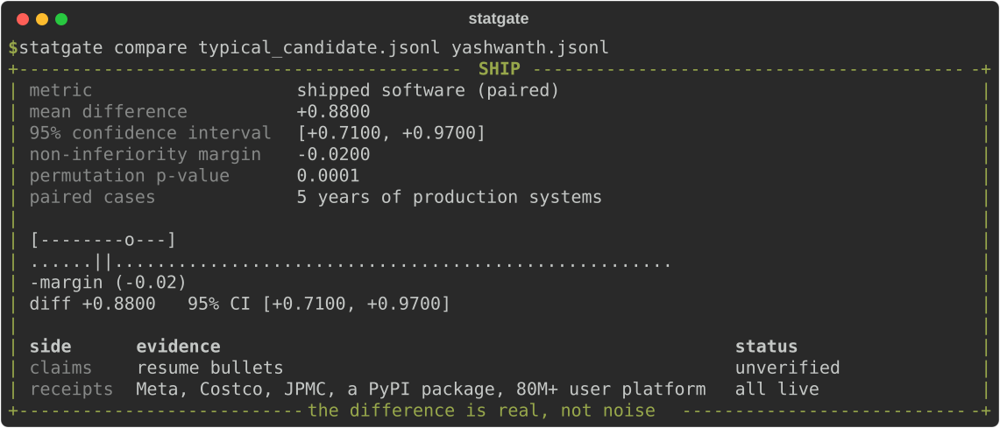

  

  Real output format, real tool, numbers lovingly fabricated. 
  The card comes from <a href="https://github.com/yashchimata/statgate">statgate</a>, a statistical CI gate for LLM evals that I built and shipped. 
  The rest of this page is the part you can verify.

## The evidence

Full Stack and AI engineer, 5+ years of production systems where LLMs meet
infrastructure. AI agent tooling and LLM eval pipelines at Meta, a membership
platform serving 80M+ cardholders at Costco, financial services at
J.P. Morgan Chase.

## Shipped and verifiable

| Project | What it is | Proof |
|---|---|---|
| [statgate](https://github.com/yashchimata/statgate) | Statistical ship or block CI gates for LLM evals: paired bootstrap verdicts, power analysis, sequential early stopping |   [Marketplace](https://github.com/marketplace/actions/statgate) |
| [Live demo PRs](https://github.com/yashchimata/statgate/pulls?q=is%3Apr+is%3Aopen+label%3Ademo) | The gate reviewing real changes in public: one pull request it ships, one it blocks with a red check | open them and look |
| [Dota 2 portfolio](https://dota2-portfolio.vercel.app) | My portfolio rebuilt as a playable game client, because a PDF has no hover states | click around |

## How I build

- **AI and LLM**: LangChain agents, RAG, PyTorch fine-tuning, evals and guardrails, ontology-driven text-to-SQL
- **Backend**: Java 21 and Spring Boot, Python FastAPI, event-driven systems on GCP Pub/Sub and AWS
- **Frontend**: TypeScript, React, Next.js
- **Runway to prod**: Kubernetes, Docker, Argo CD, GitHub Actions, GitOps

## Verdict methodology

Paired comparison of claims against receipts. Resume bullets are the
baseline. Things you can click are the candidate.

`pip install statgate` is real. The Marketplace listing is real. The 80M
cardholders are real. The p-value up top is a joke, but only because n=1:
gather more evidence at the links below.

## Say hello

[LinkedIn](https://www.linkedin.com/in/yashwanth-kumar-chimata) &middot; [Portfolio](https://dota2-portfolio.vercel.app) &middot; [Email](mailto:yashwanthchimata11@gmail.com)

Open finding, currently INCONCLUSIVE: whether 5,000+ hours of Dota 2
count as distributed systems experience. The suite is too small to tell.
